```python
import pandas as pd
```

```python
df = pd.read_csv('./work/Video_Games_Sales_as_at_22_Dec_2016.csv')
df
```

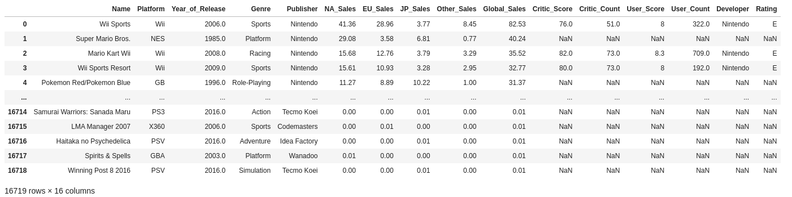


```python
df.head()
```
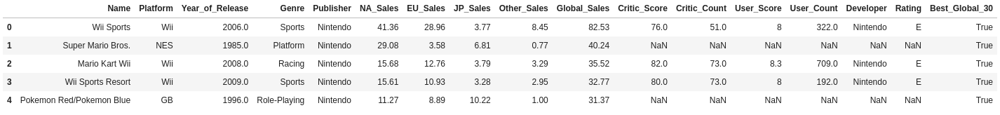

```python
df.shape
    (16719, 17)
```

```python
df.Platform.unique()
```
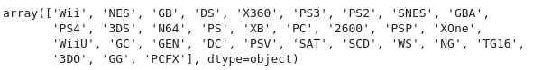


```python
df.Platform.value_counts()
```
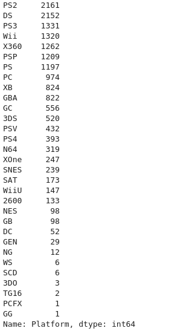


```python
df.apply(lambda row: row, axis=1)
```
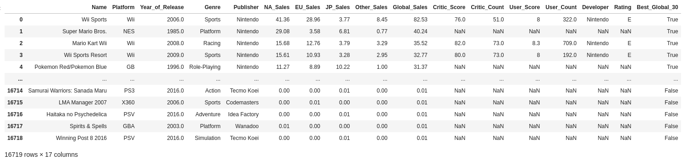


```python
df.apply(lambda row: row.keys(), axis=1)
```
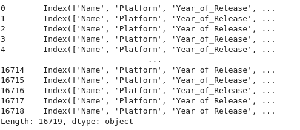


```python
df.apply(lambda row: row['Platform'], axis=1)
```
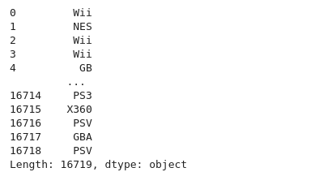


```python
df.apply(lambda row: row['Global_Sales'] > 30, axis=1)
```
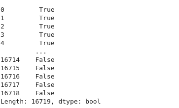


```python
df['Best_Global_30'] = df.apply(lambda row: row['Global_Sales'] > 30, axis=1)
df['Best_Global_30'].value_counts()
```
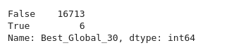


```python
genre_values = df['Genre'].value_counts()
print(type(genre_values))
genre_values

top_ten_genre_values = genre_values[genre_values > 1000]
top_ten_genre_values
```
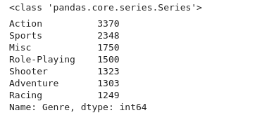

```python
genre_norm = df["Genre"].map(lambda x: x if x in top_ten_genre_values else "other")
genre_norm.value_counts()
```
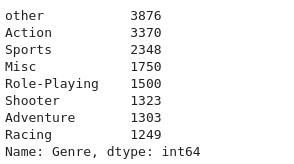


```python
pd.pivot_table(df, values=["Global_Sales"], index=["Name"]).sort_values(by=("Global_Sales"), ascending=False)
```
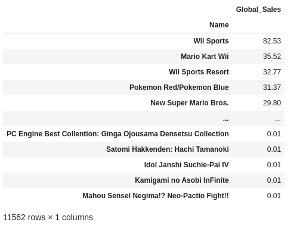


```python
(df[["Global_Sales", "Genre"]]
    .groupby("Genre")
    .agg(["mean", "median", "min", "max", "std", "size"])
)
```
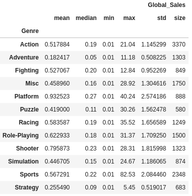

