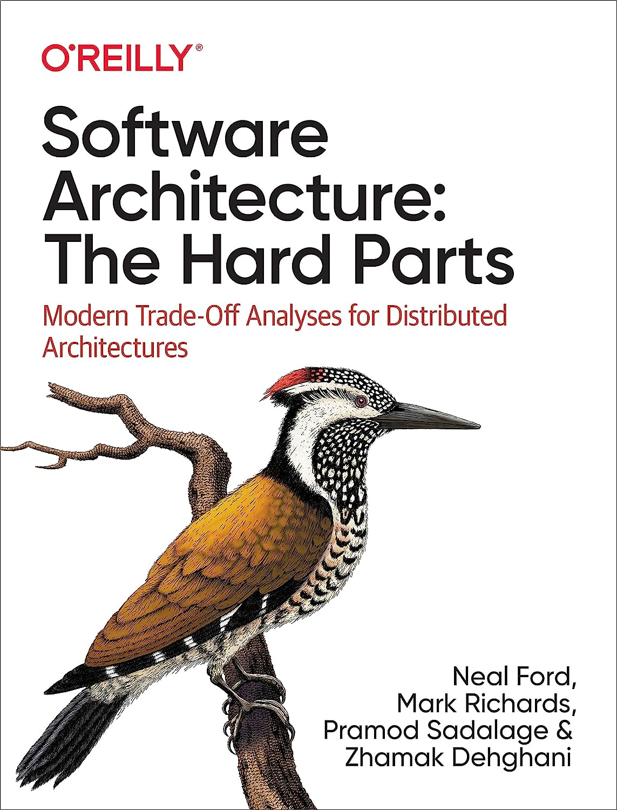

Last time, I read a great title "Software Architecture: The Hard Parts: Modern Tradeoff Analysis for Distributed Architectures"

'Compromise' is one of the main thoughts that runs through while reading this book. Is the choice we make the best one ? We need to consider a number of parameters that are important to us in order to make a choice that fits the challenge we are solving. 

Is scalability, consistency or perhaps time efficiency important to us ? 

Will we achieve this through choreography or orchestration ?

Which of our ideas is best ?

This book took me on a journey through the decisions that programmers in smaller and larger teams make. Sometimes we also make them ourselves. Before coding, it's worthwhile to look at the problem from various angles and try to choose the best "compromise".

Where to buy it ? [ENG](https://www.amazon.pl/Software-Architecture-Tradeoff-Distributed-Architectures/dp/1492086894)
[PL](https://helion.pl/ksiazki/zlozone-zagadnienia-architektury-oprogramowania-jak-analizowac-kompromisy-i-podejmowac-trudne-decyz-neal-ford-mark-richards-pramod-sadalage-zhamak,zlozag.htm#format/d)
