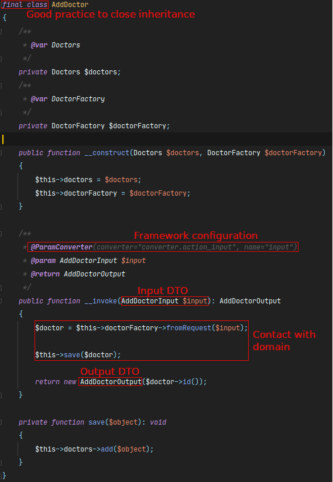

At the 13Th of December I participated in Clean Code and Architecture workshops done by Docplanner. Yep, very relevant topic
for each developer. The practicing of writing the clean code is the one of most grateful think for you, colic and your business.
The clean code allows you to make easy changes, maintainable things which you have time to forget. This is the skill to practicing
every day.

Let's focus on workshop. The repository which was prepared by **Docplanner Tech** you can find [here](https://github.com/MarcinGladkowski/clean-code-architecture)

Let's focus on content!

# Object calisthenics

To get more knowledge about that I found a great blog post of **Willam Durand** -> [here](https://williamdurand.fr/2013/06/03/object-calisthenics/)
Each rule looks great, but using it can be more complicate.

In the shortest way. It's about follow to 9 rules:

1. Only One Level Of Indentation Per Method
2. Don’t Use The ELSE Keyword
3. Wrap All Primitives And Strings
4. First Class Collections
5. One Dot Per Line
6. Don’t Abbreviate
7. Keep All Entities Small
8. No Classes With More Than Two Instance Variables
9. No Getters/Setters/Properties

Below I described some examples of providing some of these rules on workshop and this test project.

### Only One Level Of Indentation Per Method

It's a great advises except SOLID, KISS etc. I always try to avoid to many levels and **indentation** and
using **else** block.

Too long methods and functions are not a very simple and clear to read. We should to try to extract block of codes to
simple methods. Looks simple but there is a lot of patterns of refactoring like **extract function** from [Refactoring Book](https://refactoring.com/)
(Martin Fowler).

_Pro tip: If you are using PhpStorm there is shortcut to [extract code as function](https://www.jetbrains.com/help/phpstorm/extract-method.html)_

Commit: [acb1aea](https://github.com/docplanner-workshop/clean-code-architecture/commit/acb1aea47fdbb802b2717b0c249ff6bcbeebedd5)


### Don't Use The ELSE Keyword

This simple change cam simplify a code to read and testing it. Less cyclomatic and cognitive complexity.
But we don't forget about _return_ statement, because this technique allows us to safely execute code.

Commit: [a566791](https://github.com/docplanner-workshop/clean-code-architecture/commit/a566791fb121bc6469447a5ae400e682fe5a6bab)


Another example of this technique. It's mean to fast quit from method when relevant data are missing.

```php
public function doSomething($params): ?someType
{
    if (empty($params)) {
        return null;
    }
}
```

### Don't Abbreviate

Using a meaningful variables names can be very helpful. What's we have done with code:
[0d1b74f](https://github.com/docplanner-workshop/clean-code-architecture/commit/0d1b74f3cb706a98f870421bba34061bcf5b1def?branch=0d1b74f3cb706a98f870421bba34061bcf5b1def&diff=unified)
[120a26e](https://github.com/docplanner-workshop/clean-code-architecture/commit/120a26ed7d1da0a31a983341419d2560b09ac52a?branch=120a26ed7d1da0a31a983341419d2560b09ac52a&diff=unified)

Meaningful names changes a readability a lot:


### Wrap All Primitives And Strings

When I heard this my first thought was - Value Object. The convention of [Value Object](https://martinfowler.com/bliki/ValueObject.html) comes from DDD (Domain Driven Design) techniques. Shortly, It's about to wrap meaningful values - usually they can be store in primitive values.

```php
<?php declare(strict_types=1);

namespace App\Model;

class Specialization
{
    private string $name;

    public function __construct(string $name)
    {
        $this->name = $name;
    }

     public function name(): string
     {
         return $this->name;
     }

     public function equals(Specialization $specialization): bool
     {
         return $this->name === $specialization->name();
     }
}
```

### No Getters/Setters/Properties

Since I trying to create immutable objects like **VO** there are any getters and setters. The state is usually
passing by _\_\_constructor_. The same thing is about to _wrapping all primitives_. We can follow this rule by using DTOs.

```php
class Doctor
{
    private string $firstName;
    private string $lastName;
    private Specialization $specialization;

    public function __construct(string $firstName, string $lastName, Specialization $specialization)
    {
        $this->firstName = $firstName;
        $this->lastName = $lastName;
        $this->specialization = $specialization;
    }

    public function firstName(): string
    {
        return $this->firstName;
    }

    public function lastName(): string
    {
        return $this->lastName;
    }

    public function specialization(): Specialization
    {
        return $this->specialization;
    }
}
```

Some rules can be hard to follow them for example this one about _only two instance variables_. Usually in bigger project exist specialized services
doing to much things (the SRP - Single Responsibility Rule is break also) with a lot of some dependencies.

# Architecture

I am sure, all web developers knows at least one architecture pattern MVC (Model-View-Controller). When I write my first
code as a Junior developer I pasted a lot of code to controllers. I think a lot of developers made mistake like this.
If you get some knowledge and experience, you will see the bad side of this solution. In my opinion each should meet this
problem to saw what's wrong with this architecture. I don't say it's bad patters but have some limitations. Many of developers
cannot have idea _where should I put this code?_ because they have only three official layers: _model, controller, view_.
What's the most dangerous to put all logic code into controller? Then developers put business logic also to controller,
model and view!. Developing in this way makes a lot off mess in our code and if we want to apply some little change
we have to look it very careful! The code isn't reusable.

What we can do in this case ?

I hope you heard about **SOLID** principles. These rules are independent from programming languages. Only interesting thing is
this is the most popular requirement question for programmer. If you don't know this rules, hurry up! You should memorize it.

Using SRP (Single Responsibility Principle) and DI (Dependency Inversion) we can easily decouple our logic and relation between
classes.

Some steps of refactoring to make our code clean:

- Moving methods to external class (service)
- Not using lower level dependencies in a service
- Depend in Abstractions, not on implementations (ex. create and interface)
- Moving out Request handling out of the Controller
- Entities refactoring (no getters/setters, guard invariants (valid domain state)...)

Look at this example controller, please. Looks good, but can we do better ?

```php
class Controller extends AbstractController
{
    public function index()
    {
        return new JsonResponse('ReallyDirty API v1.0');
    }

    /**
     * @Route("/doctor", methods={"POST"})
     * @param Request $request
     * @return JsonResponse
     */
    public function addDoctorAction(Request $request)
    {
        $doctor = $this->createDoctorFromRequest(
            $request->get('firstName'),
            $request->get('lastName'),
            $request->get('specialization')
        );

        $this->save($doctor);

        return new JsonResponse(['id' => $doctor->getId()]);
    }

    /**
     * @Route("/doctor", methods={"GET"})
     * @param Request $request
     * @return JsonResponse
     */
    public function getDoctorAction(Request $request)
    {
        $doctor = $this->getDoctor($request->get('id'));

        if (!$doctor) {
            return new JsonResponse([], 404);
        }

        return new JsonResponse(
            [
                'id' => $doctor->getId(),
                'firstName' => $doctor->getFirstName(),
                'lastName' => $doctor->getLastName(),
                'specialization' => $doctor->getSpecialization(),
            ]
        );
    }

    // and more and more...
```

What the cons of this solution:

- If have a lot of endpoints it can be verrryy long class (thousands lines of code...)
- The controller depends of Request class.
- We have to decide which type response we want JSON, XML or something else.
- We have to parse incoming data, but maybe it not only from HTTP request ?

There is a time for **Action Domain Responder**

This architecture pattern is quite new for me and was I found it isn't very old (like MVC - 1979).
But great to get new knowledge about architecture. Invited and described by [Paul M. Jones](http://paul-m-jones.com/)
in 2014 using **PHP**! oh yeah!


And the MVC pattern


I am not a super expert in Symfony framework but some Docplanner created a blog post about
implementation ADR [here](https://medium.com/swlh/implementing-action-domain-responder-pattern-with-symfony-606539eea3a7)

But the main core of ADR is above. The main action class has a dependency injection with are _Doctors_ and _DoctorFactory_.
Focus on remember to using _interfaces_. The one thing is strictly tie with framework is an this _annotation_.
This action looks very clear, the input and output are specified DTO classes.

DTO of input.

```php
<?php declare(strict_types=1);

namespace App\Action\Input;

use Symfony\Component\Validator\Constraints as Assert;

final class AddDoctorInput
{
    /**
     * @Assert\NotBlank()
     * @var string
     */
    private string $firstName;
    /**
     * @Assert\NotBlank()
     * @var string
     */
    private string $lastName;

    private string $specialisation;

    public function __construct(string $firstName, string $lastName, string $specialisation)
    {
        $this->firstName = $firstName;
        $this->lastName = $lastName;
        $this->specialisation = $specialisation;
    }

    public function getFirstName(): string
    {
        return $this->firstName;
    }

    public function getLastName(): string
    {
        return $this->lastName;
    }

    public function getSpecialisation(): string
    {
        return $this->specialisation;
    }
}
```

Dto of output. Very simple to use it to make an system response in each kind of: JSON, XML etc.

```php
<?php declare(strict_types=1);

namespace App\Action\Output;

final class AddDoctorOutput
{
    private int $id;

    public function __construct(int $id)
    {
        $this->id = $id;
    }

    public function getId(): int
    {
        return $this->id;
    }
}
```

How look controller now ? You have right - it's not necessary.

```php
<?php declare(strict_types=1);

namespace App\Controller;

use Symfony\Bundle\FrameworkBundle\Controller\AbstractController;
use Symfony\Component\HttpFoundation\JsonResponse;

class Controller extends AbstractController
{
    public function index(): JsonResponse
    {
        return new JsonResponse('ReallyDirty API v1.0');
    }
}
```

_This post is a some shortcut to memorize these things.
It can looks a little chaotic but it's first post for 2021._

Full presentation: [here](https://docs.google.com/presentation/d/1RkrPrKNUL1DVmHuRFA6RC5eHPRG0xUiNsZLEfI0CZzw/edit#slide=id.gaeea1ef32b_1_1)

The workshop was great! Thanks for all Docplanner team!

_Marcin_
