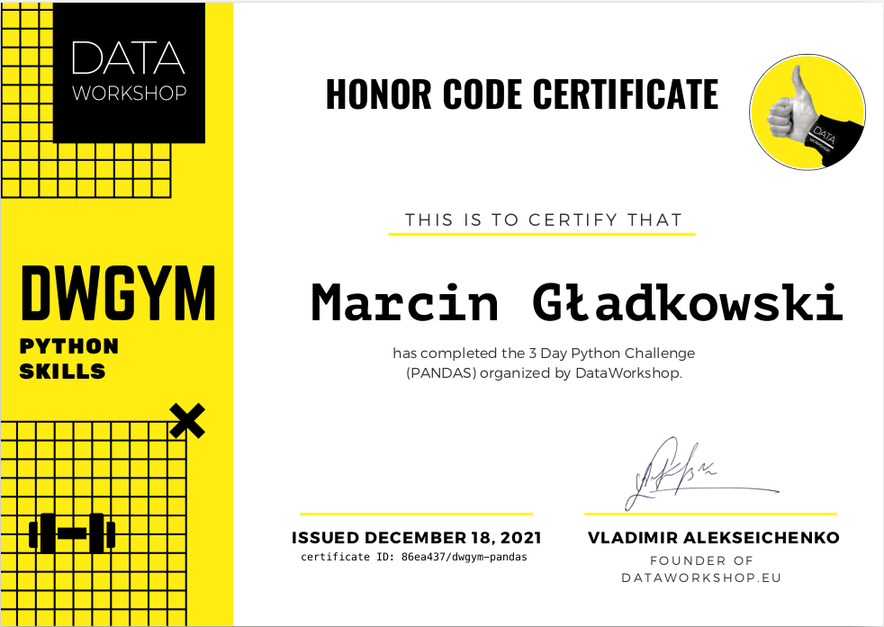

Today I reveived certyficate of finish 3 day python challenge organized by Data Workshop. The challenge was in december of previous year but I think this is
a good idea to repeat what we trained. The main topic on challenge was Pandas library. I think it's the most popular library in Python to work with data.

In this post I will show all commands used in challenge exercises. Also, I will write how to start with Pandas and how to run your code with some data 
and try to execute these commands. 

Firstly, we need some data and environment A lot of datasets we can find on **kaggle.com**. I choosed set with [video games](https://www.kaggle.com/rush4ratio/video-game-sales-with-ratings). 
To eaisly work with data we can choose Jupyter. The fastest way is using it with docker. 

How to run it ? Just execute a command:
```bash
docker run --rm -p 8888:8888 -e JUPYTER_ENABLE_LAB=yes -v ${PWD}:/home/jovyan/work jupyter/datascience-notebook
```
_Remember: ${PWD} evaluated to current directory. I execute command in directory when I save dataset file._ 

### Working with Pandas
With short explanations.

_Import library to using it. `pd` is only alias, but using very often and treat as good practice._
```python
import pandas as pd
```

---

_Load csv dataset. Of course datasets can be in other formats like xlsx. Typing only `pd` and executed shows result like `print()` function_
```python
df = pd.read_csv('./work/Video_Games_Sales_as_at_22_Dec_2016.csv')
df
```
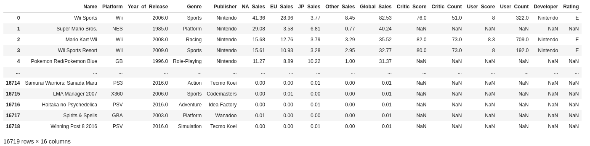

---

_To show some rows without printing everything_
```python
df.head()
```
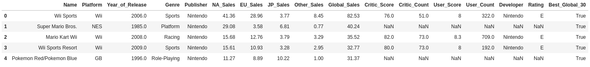

---

_The numbers of (rows, columns)_
```python
df.shape
    (16719, 17)
```

---

_For each column we can display unique values. In this example for `Platform` column_
```python
df.Platform.unique()
```
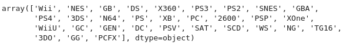

---

_Fuction to count how many rows have a unique value for column. In this example for `Platform`_
```python
df.Platform.value_counts()
```
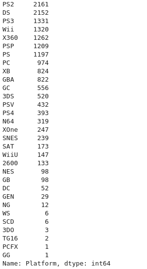

---

_Function apply on data frame alows to work with each row. In this example we not doing anything. Just returned `row`_
```python
df.apply(lambda row: row, axis=1)
```
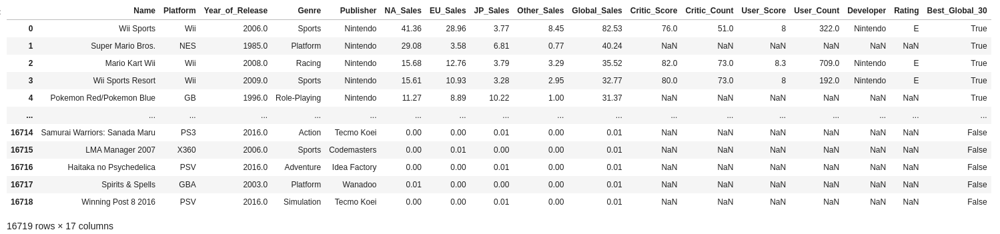

---

_The same like above but we returning `keys` and it's mean - column names_
```python
df.apply(lambda row: row.keys(), axis=1)
```
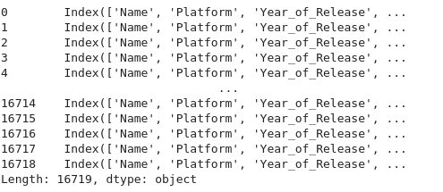

---

_Choosing only one column from row_
```python
df.apply(lambda row: row['Platform'], axis=1)
```
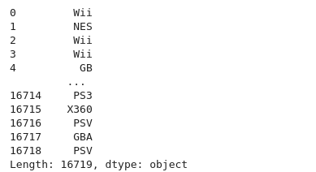

---

_Add statement to check data. It's evaluate to `True` and thats why we see only booleans on output_
```python
df.apply(lambda row: row['Global_Sales'] > 30, axis=1)
```
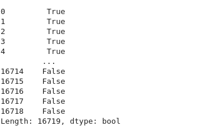

---

_Mix using `apply()` and `value_counts()`_
```python
df['Best_Global_30'] = df.apply(lambda row: row['Global_Sales'] > 30, axis=1)
df['Best_Global_30'].value_counts()
```
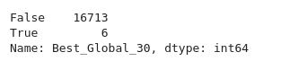

---

_Get `value_counts()` of column and choose only by statement. Pandas work on this data as a `Series` of data. Details in documentation._
```python
genre_values = df['Genre'].value_counts()

top_ten_genre_values = genre_values[genre_values > 1000]
top_ten_genre_values
```
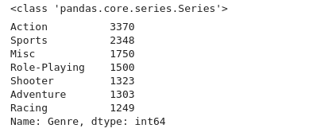

---

_Using filtered only top values we can work again with main data_
```python
genre_norm = df["Genre"].map(lambda x: x if x in top_ten_genre_values else "other")
genre_norm.value_counts()
```
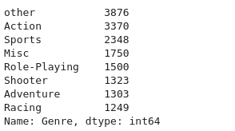

---

_Grouping and aggregate functions. Pandas contains data structures like `pivot_table`, and allows us to count values like minumum, maximum etc_
```python
pd.pivot_table(df, values=["Global_Sales"], index=["Name"]).sort_values(by=("Global_Sales"), ascending=False)
```
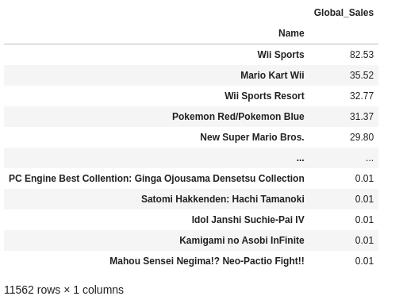


```python
(df[["Global_Sales", "Genre"]]
    .groupby("Genre")
    .agg(["mean", "median", "min", "max", "std", "size"])
)
```
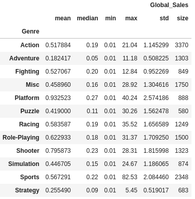


Thanks for reading this. It was a small recap of workshop exercises.

Marcin
