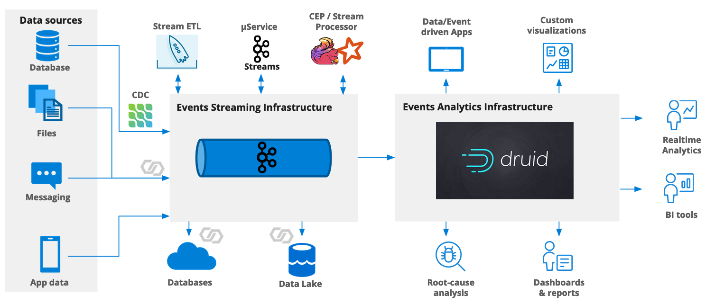

Let's kick off meetups in 2024!

In this brief post, I aim to provide a snapshot of the presentations. The tools and infrastructure for these solutions constitute a vast topic, and a single post cannot do justice to its explanation.

I had a opportunity to visit Kraków for Kafka meetup and listen to curious presentations from great two professionalist.

***

#### Building an Event Analytics Pipeline with Kafka, ksqlDB, and Druid.

##### Stack: 
* [Apache Druid](https://druid.apache.org/)
* [ksqlDB](https://ksqldb.io/)
* [kafka](https://kafka.apache.org/)  

Let's assume you are using a traditional ETL (Extract - Transform - Load) architecture. What solution to analyse data do you have ? There are many of tools that can help you to visualize loaded data. It's not an issue to use tools like Apache Spark to run query and e.g. aggregate data over some period of time. 

What's about to analyze data directly form Kafka topic's ? What possible by using Apache Druid.

##### Let's see what you can use for Apache Druid 

The picture below presents possible solutions of architecture and where Apache Druid can be placed.

> source: https://blog.hellmar-becker.de/2021/11/19/apache-druid-in-the-publishing-industry/

Let's go with simple example presented by Hellmar Becker.
> Example that was presented by using Docker Compose that you can easily run it in your's local environment.

Than we can use our instance of Apache Druid to analyze data. 

***

#### Migration with MirrorMaker 2.0

* [AWS about migration](https://docs.aws.amazon.com/whitepapers/latest/amazon-msk-migration-guide/mirrormaker-2.0-mm2.html)
* [Microsoft Learn](https://learn.microsoft.com/en-us/azure/hdinsight/kafka/kafka-mirrormaker-2-0-guide)

Second presentation focused on migrating Kafka cluster from one to another cloud provider. Thanks to the tool like is MirrorMaker, this process has become remarkably straightforward. In general, tool replicates topics, ACL (version 2.0 only) and synchronizing offsets. Thats allows to connect consumers to replicated cluster and then move producing to new one and then remove old cluster. 

#### What's interested to dive deppper 
* `ksqlDB` - during researching links and materials for this post I found a plenty of interesting knowledge.
    * [Introduction to ksqkDB](https://talks.rmoff.net/LjZAS7/intr) - video presentationm, demo code, eBook and more.

That's was fruitful meetup. Thanks to organizers and hope to see next time!
