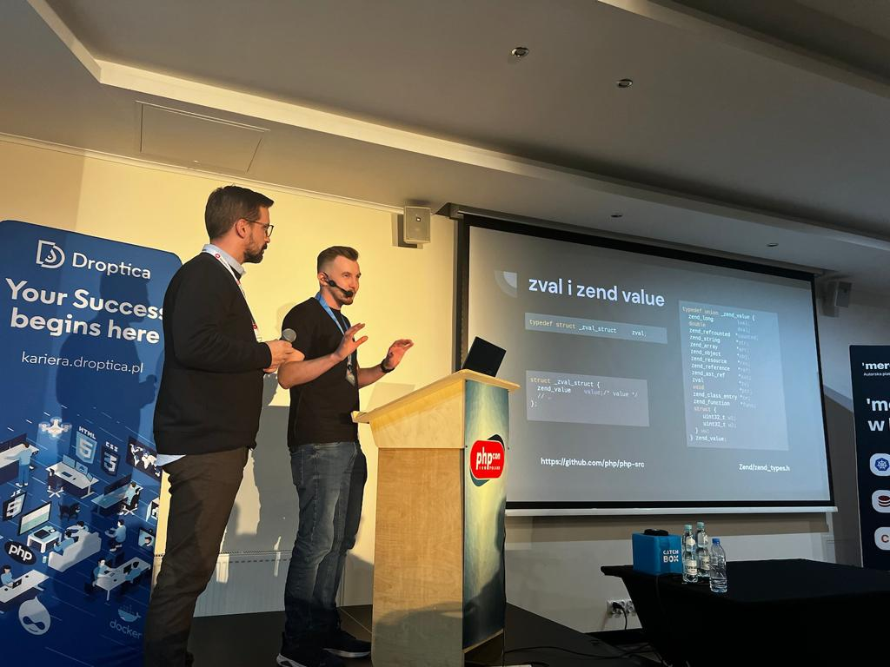

This year conference [PHPcon Poland 2022](https://2022.phpcon.pl/) was so special for me. Everything because I presented a topic
"Memory leaks in long processes - practice". On material I worked with [Łukasz Jaworski](https://www.linkedin.com/in/%C5%82ukasz-jaworski-977078130). For me and Łukasz
it was the first time as presenters. That experience gives me a lot of confidence and bravery. As a programmer 
I always wanted to do something for community by first open source commits and share knowledge, my point
of see. 

Repository with examples: https://github.com/lljaworski/memory_leak_php

Presentation on slides: 
<iframe src="https://www.slideshare.net/slideshow/embed_code/key/GnjXvRToOdqeIi?hostedIn=slideshare&page=upload" width="476" height="400" frameborder="0" marginwidth="0" marginheight="0" scrolling="no"></iframe>

I've got plan to write blog posts about this topic.

