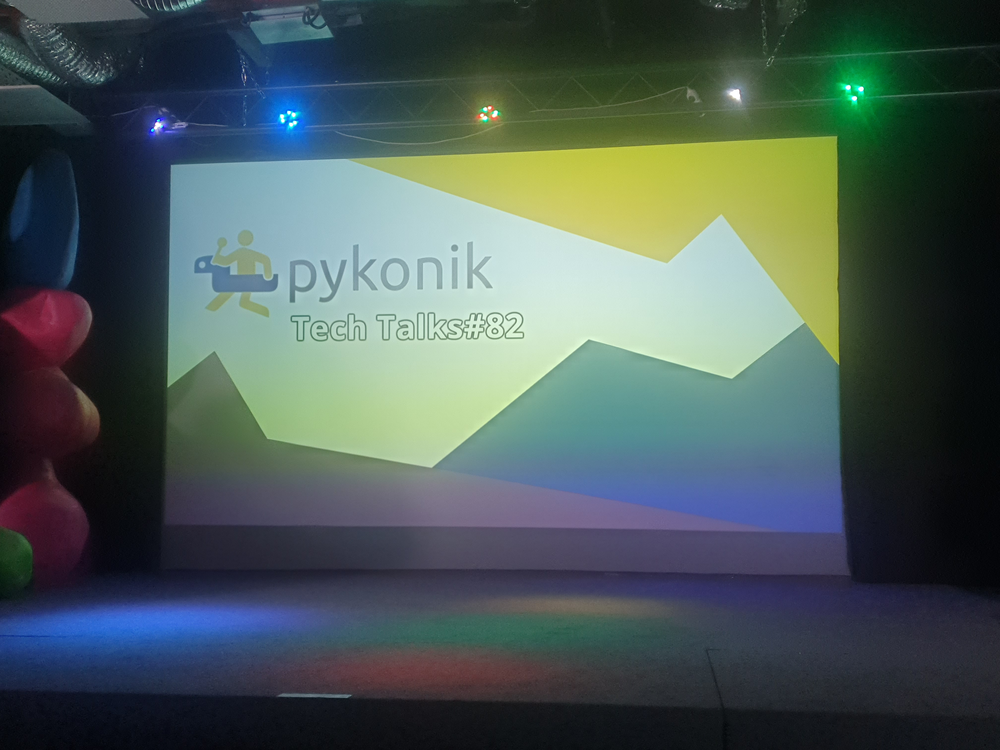

Let's kick off meetups in 2026!

That was my first time at a meetup like this - Pykonik. Organized in Kraków by a small group of enthusiasts. There was so much energy and joy. A few interesting topics were presented: spawning new threads, local coding agents, and music generation.

My surprise was that so many people were prepared for lightning talks. I saw 6 or 8 people going to the stage one by one to show off some small personal idea or new insight.

**Meetup website and record [Pykonik - Tech Talks #82](https://www.pykonik.org/tech-talks/82/)**

