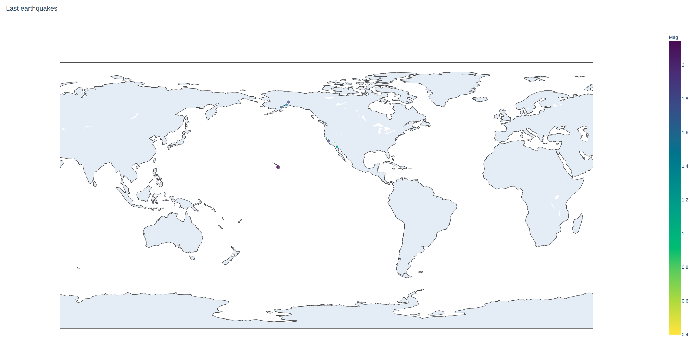
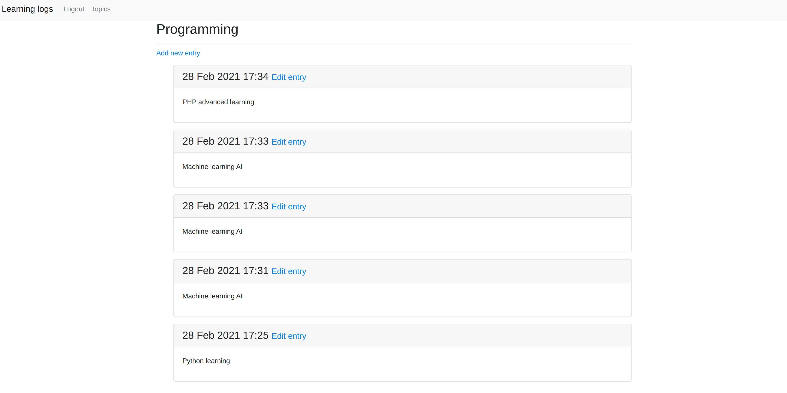

### Python Crash Course (2nd Edition) - Book review

From last few months I learn a Python. The first step of learning
new programming language was a watching some tutorials of basics.
At first glance the Python have a plenty of good things like super
simple syntax, code formatting, managing virtual environments.

Then I decided to get some simple projects. Thanks for my company for entertainment budget. I bought a this book.

The book has two main parts. At the first we learning about
basic scripts. Just started form declaring variables, loops, imports.
Basically, about syntax and types for very simple scripts. The language (I've got polish translation) of describing how to write a script is for people who never coding. I've just learn something new but describing by author over and over the same can be boring for
someone who actually works as programmer. To be fair, I decided to
buy this book and I'm very happy.

The second part is about projects. The main projects are game about shooting to aliens, analyzing data with visualization and web application. I've never wrote desktop game but game using PyGame
library was very fun for me. There is the same point as in previous
part. After numerous of pages the developing of game was a little boring.

Next part about visualizations data shows me why the Python is often using to this tasks. Libraries like matplotlib, plotly doing a great job and usage of them are not complicate but they have a lot of
options.

The last project was a web application to monitors progress of learning. I'm a PHP developer and I was surprized how Django is similar to other frameworks from another programing language.
There are the same ideas like cli commands, views, controllers. The
last step was a developing this app on Heroku, and was very interesting for me.

In summarize. The book is quite good but for beginners. If you have
some experience in programming this lecture can be boring for you. The author elaborate some topis very wide - I mean a lot of times and many of pages.

Regards

Marcin
