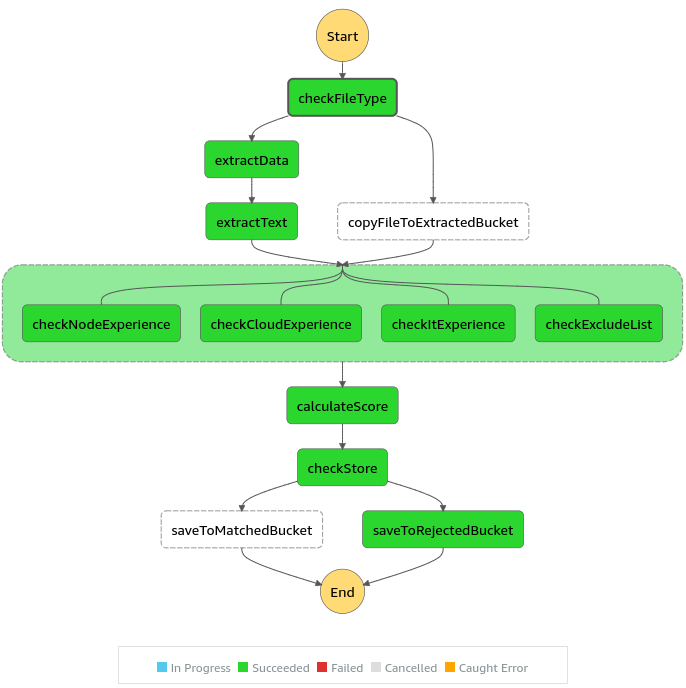

Last time I participated in workshops about [AWS Step Functions](). This service provided by AWS was created for implementing flow of
our application and close the paths in [state machine](https://en.wikipedia.org/wiki/Finite-state_machine). This service can be created and maintained from Serverless Framework which 
is one of the most popular frameworks to manage cloud resources and applications. The mentors created a repository to start our journey and resolve tasks during 2 days workshop.

### Advantages of step functions:
- allow us to manage many of services in our cloud applications (ex. lambdas)
- visualize steps and executed path
- easily to find logs, passed inputs/outputs
- ASL to declare step flow
- usage with frameworks as Serverless Framework
- developing locally (Serverless framework with plugin)
- move our thinking to implement our application as small possible steps
- possible to usage other aws services from steps declaration
- ...

Started repository:  https://github.com/TheSoftwareHouse/tsh-academy-serverless  
My repository: https://github.com/MarcinGladkowski/aws-step-functions-workshops  
Step functions and Severless framework: https://www.serverless.com/guides/aws-step-functions  

#### I will go through some examples/features 

### ASL - Amazon State Language
Most of examples in the documentation are in JSON bu using SF we can describe it in __yml__

#### Step types

The powerful of ASF we can see on more complicated flow. Below You can see the __Choice__ type. Similary to __switch()__ or __match()__
functions in programming languages. This is our first step of flow. As we can se there are some other keywords as `StringEquals` to 
compare returned parameter.
```yml
Comment: "Scan user CV document for data"
StartAt: checkFileType
States:
  checkFileType:
    Type: Choice
    Choices:
      - Variable: $.extension
        StringEquals: "txt"
        Comment: Is a text file?
        Next: copyFileToExtractedBucket
    Default: extractData
```
__Choice__ type allows to use other keywords to compare input.

For example __NumericGreaterThan__ for numeric comparison

```yml
checkScore:
    Type: Choice
    Choices:
      - Variable: $.calculatedScore
        NumericGreaterThan: 100
        Comment: Is a match?
        Next: saveToMatchedBucket
    Default: saveToRejectedBucket
```

#### Calling services

The next one will be step with calling other service like __textract:analyzeDocument__. 

Full list of integrations:
 https://docs.aws.amazon.com/step-functions/latest/dg/supported-services-awssdk.html#supported-services-awssdk-list

AWS service we define like __arn:aws:states:::aws-sdk:[service]:[apiAction]__

```yml
  extractData:
    Type: Task
    Resource: arn:aws:states:::aws-sdk:textract:analyzeDocument
    Parameters:
      Document:
        S3Object:
          Bucket: !Ref inputBucket
          Name.$: $.key
      FeatureTypes:
        - TABLES
        - FORMS
    ResultPath: "$.taskresult"
    Next: extractTe
```

#### Parallel step execution

The best thing is that we haven't wait for all services using language mechanism of 
asynchronous execution. I this case the result of all __parallel__ steps will be passed
to __calculateScore__ at once, like one event in lambda handler. 

```yml
  checkExperience:
    Type: Parallel
    Branches:
      - StartAt: checkNodeExperience
        States:
          checkNodeExperience:
            Type: Task
            Resource: !GetAtt checkNodeExperience-lambda.Arn
            End: true
      - StartAt: checkCloudExperience
        States:
          checkCloudExperience:
            Type: Task
            Resource: !GetAtt checkCloudExperience-lambda.Arn
            End: true
      - StartAt: checkItExperience
        States:
          checkItExperience:
            Type: Task
            Resource: !GetAtt checkItExperience-lambda.Arn
            End: true
      - StartAt: checkExcludeLists
        States:
          checkExcludeLists:
            Type: Task
            Resource: !GetAtt checkExcludeLists-lambda.Arn
            End: true
    Next: calculateScore
```

Full workflow implemented on workshop



Of course, the step functions has a lot of more features like graphical editor, executing in loops and others.

Best,
Marcin