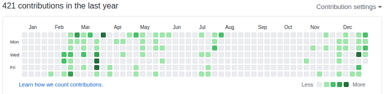

This year - i mean 2020 was an unusual year for everyone - I think.
Therefore each should summarize own actions. In this post I will write what i have achieved in 2020
and what i want to achieve in 2021.

In last few days I created this blog. It's another shoot to still practicing writing blog posts.

How looks this year on github ? Not bad, not good.

I've got plan to fill the 2021 in green!

## 2020

- The most important change - work!
- I learning **Python** from last few months - it's some repo which I store some exercises [python](https://github.com/MarcinGladkowski/python)
- I learned a lot of AWS services - I done course of Sephane Maarek [Ultimate AWS Certified Developer Associate 2021 - NEW!](https://www.udemy.com/course/aws-certified-developer-associate-dva-c01/), but it's to early to pass an exam without stress.
- I got some basic knowledge about DDD techniques. I read Domain-Driven Design in PHP and Domain-Driven Design Distilled (Vaughn Vernon)
- I have finished the one of the best book about programming (yep, today): 'Zrozumieć programowanie' (Gynvael Coldwind)
- I training a lot of programming. Besides of repo i practiced resolving some golf (from Coding Dojo Silesia) and other exercises
  - Coding Dojo Silesia events:
    - [Game of life - JS](https://github.com/MarcinGladkowski/gameoflife-kata)
    - [Sql engine - JS](https://github.com/MarcinGladkowski/sql-engine-kata)
    - [Vending Machine - PHP - not finished](https://github.com/MarcinGladkowski/vending-machine-php)
  - WarsawJS:
    - [WarsawJS workshop 43 - intermediate javascript training](https://github.com/MarcinGladkowski/warsawjs-workshop-43)
    - [WarsawJS Workshop #44 - Design Patterns](https://github.com/MarcinGladkowski/warsawjs-workshop-44-design-patterns)
    - [WarsawJS workshop #46 - Unit testing](https://github.com/MarcinGladkowski/warsawjs-workshop-46-piotrek)
  - Docplanner Workshops:
    - [Bank - my implementation of Event Sourcing](https://github.com/MarcinGladkowski/Docplanner_Tech_Workshops_1)
    - [Clean Code workshop](https://github.com/MarcinGladkowski/clean-code-architecture)
  - Others
    - [Basics of Bash](https://github.com/MarcinGladkowski/bash-training)
  - I am sure, that was a lot of other things...
- I participated in only one stationary conference (Boiling Frogs 2020) :/

## 2021

- Keep going with Python and AWS services
- I want to create some IoT things (like magic mirror)
- Keep training programming languages a lot!
- And also practicing my speaking English.
- Do something for open source.
- Participate in some hackathon.

_Marcin_
